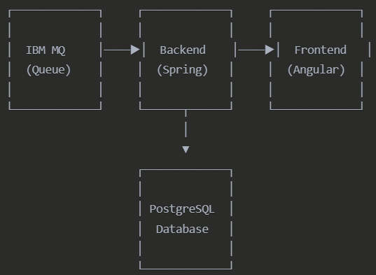
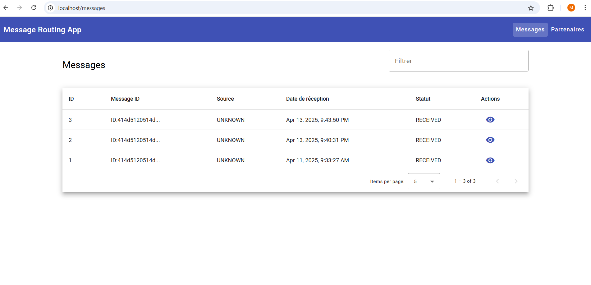
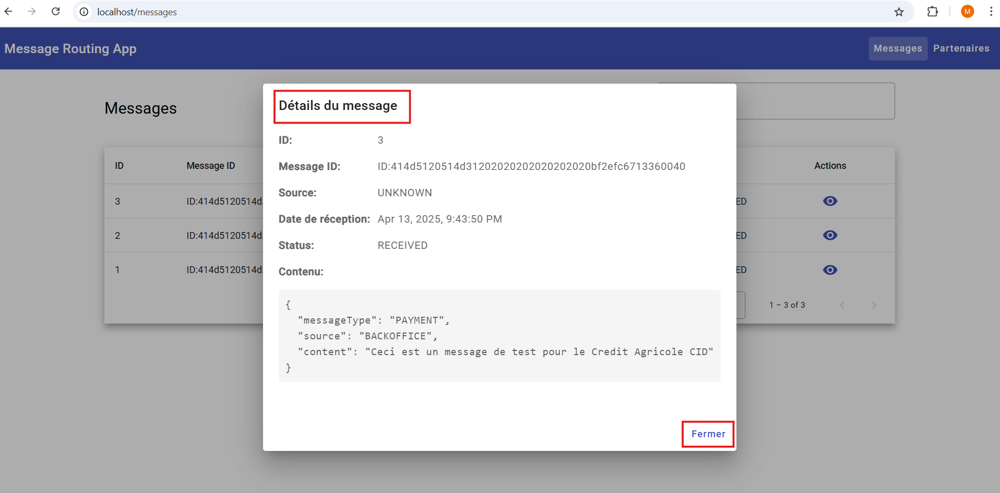
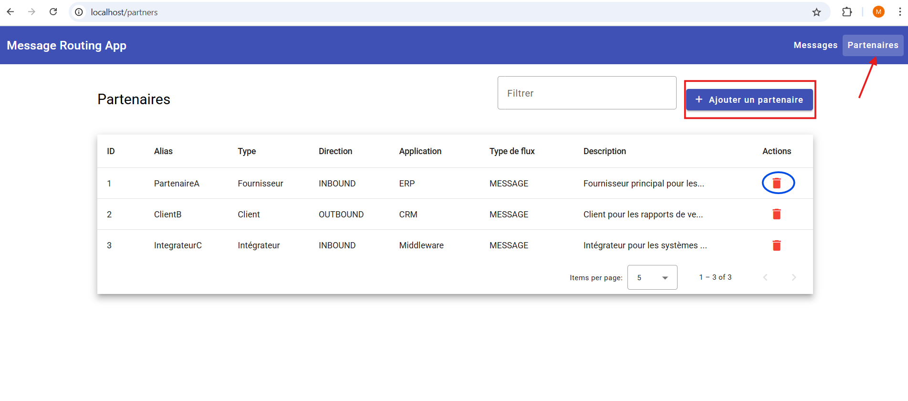
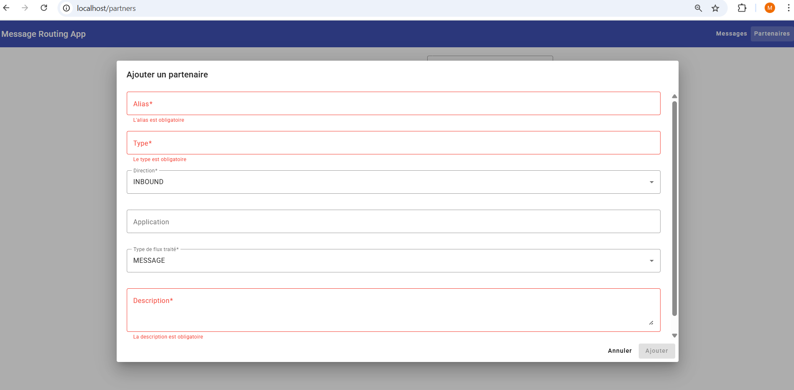
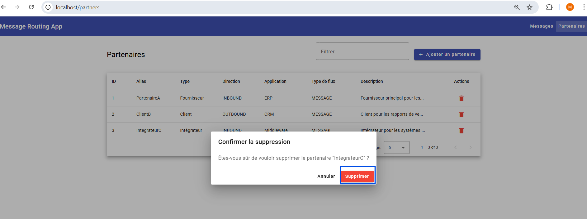
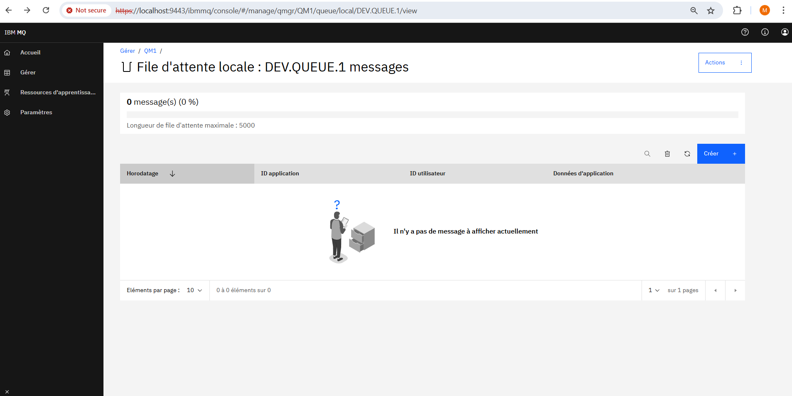
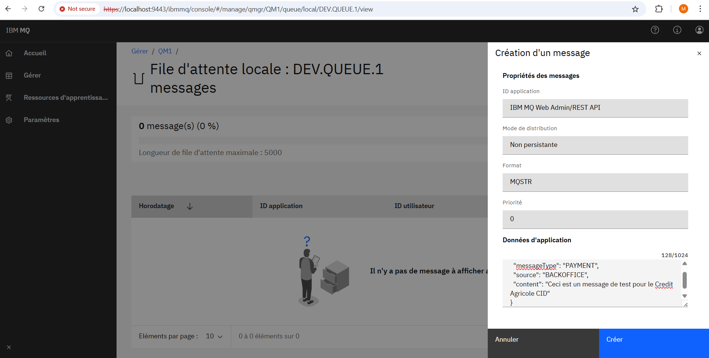
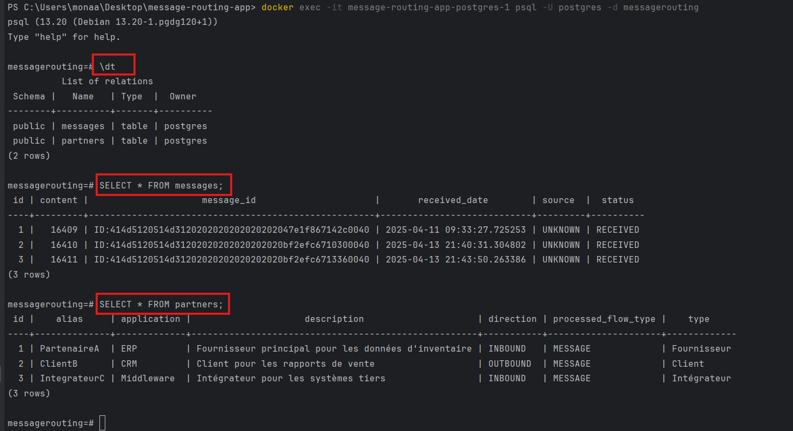

# Application de Routage de Messages Bancaires
Cette application a été développée pour le département de paiement de la banque afin de gérer les messages provenant des applications Back Office via IBM MQ Series.

# Table des matières
* Architecture
* Fonctionnalités
* Technologies utilisées
* Installation et déploiement
* Utilisation de l'application
* API Documentation
* Choix techniques et bonnes pratiques

# Architecture
L'application suit une architecture en couches avec :
* Frontend : Application Angular avec Angular Material pour l'interface utilisateur
* Backend : API REST développée avec Spring Boot
* Middleware : Intégration avec IBM MQ Series pour la réception des messages
* Persistence : Base de données PostgreSQL pour le stockage des messages et partenaires
  

# Fonctionnalités
## Gestion des Messages
* Réception automatique des messages depuis IBM MQ Series via JmsListener
* Stockage des messages dans la base de données PostgreSQL dans la table messages
* Affichage des messages dans un tableau paginé
* Recherche de messages par texte pour faciliter le filtrage
* Pagination dynamique côté backend pour optimiser les performances avec un grand volume de données

## Gestion des Partenaires
* Affichage des partenaires dans un tableau
* Stockage des partenaires dans la base de données PostgreSQL dans la table messages
* Pagination statique côté frontend adaptée à un nombre limité de partenaires
* Filtrage des partenaires directement dans l'interface
* Ajout de nouveaux partenaires avec validation des données
* Suppression de partenaires existants avec confirmation via une boîte de dialogue Material
* Validation du formulaire pour assurer l'intégrité des données

## Navigation et Interface
* Menu intuitif permettant de naviguer entre les différentes sections
* Affichage par défaut du composant Messages au démarrage de l'application
* Interface responsive adaptée à différentes tailles d'écran
* Design épuré et professionnel grâce à Angular Material

# Technologies utilisées
## Backend
* Java 17
* Spring Boot 3.4.3
* Spring Data JPA pour la persistence
* Spring JMS pour l'intégration avec IBM MQ
* PostgreSQL comme base de données relationnelle
* Maven pour la gestion des dépendances
* Lombok pour la réduction du code boilerplate

## Frontend
* Angular 19
* Angular Material pour les composants UI
* RxJS pour la gestion des flux asynchrones

## Infrastructure
* Docker & Docker Compose pour la conteneurisation
* Nginx pour servir l'application Angular

# Installation et déploiement
## Prérequis
* Docker et Docker Compose
* Git

## Installation
1. Cloner le dépôt

        git clone https://github.com/boussoufi/message-routing-app.git
        cd message-routing-app

2. Lancer l'application avec Docker Compose 

        docker-compose up -d

L'application sera disponible aux adresses :
* Frontend : http://localhost
    - Note: Si vous ne voyez pas la page des messages s'afficher automatiquement, essayez de vider le cache de votre navigateur ou d'ouvrir l'application dans une fenêtre de navigation privée ou essayer dans un notre navigateur.
* Backend API : http://localhost:8081/api
    - Note: L'URL de base renvoie une page d'erreur 404 car il n'y a pas de mapping explicite pour cette route.
         #### Endpoints disponibles:
            * Liste des partenaires: http://localhost:8081/api/partners
            * Liste des messages: http://localhost:8081/api/messages
* IBM MQ Console : https://localhost:9443/ibmmq/console (admin/passw0rd)

# Installation pour le développement
Pour développer localement sans Docker :
1. Backend (Spring Boot)

        Ouvre IntelliJ IDEA

        Ouvre le dossier message-routing-app-backend comme projet.

        Si demandé, importe le projet Maven (via le fichier pom.xml).

        Dans le panneau Maven (à droite) :

        Va dans Lifecycle → clique sur clean puis install pour builder le projet.

        Lance l’application :

        Soit depuis la classe principale (@SpringBootApplication) → clic droit → Run

        Soit en créant une configuration Spring Boot dans Run > Edit Configurations

2. Frontend (Angular)

       Ouvre un nouveau projet IntelliJ (ou un autre onglet/fenêtre) avec le dossier message-routing-ui

       Dans le terminal intégré IntelliJ :
        
       npm install
       ng serve
       (Assure-toi que Angular CLI est installé globalement : npm install -g @angular/cli si besoin)

# Utilisation de l'application
## Consultation des messages
Accédez à la page "Messages" depuis le menu principal
1. Les messages sont affichés dans un tableau paginé
2. Vous pouvez filtrer les messages en utilisant la barre de recherche
3. Pour voir les détails d'un message, cliquez sur l'icône "Voir"

## Gestion des partenaires
1. Accédez à la page "Partenaires" depuis le menu principal
2. Pour ajouter un partenaire, cliquez sur le bouton "Ajouter un partenaire" et remplissez le formulaire
3. Pour supprimer un partenaire, cliquez sur l'icône "Supprimer" et confirmez l'action

## Envoi de messages via IBM MQ (pour tests)
1. Accédez à la console IBM MQ à l'adresse https://localhost:9443/ibmmq/console (admin/passw0rd)
2. Naviguez vers la file DEV.QUEUE.1
3. Cliquez sur "Créer" pour ajouter un message
4. Entrez le contenu JSON du message dans le champ "Données d'application"
5. Vérifiez que le message apparaît dans l'application

##### Pour voir les tables et données dans la base PostgreSQL

# API Documentation
L'API REST du backend expose les endpoints suivants:

## Messages
* GET /api/messages : Récupérer tous les messages (paginés)
* GET /api/messages/{id} : Récupérer un message spécifique

## Partenaires
* GET /api/partners : Récupérer tous les partenaires
* GET /api/partners/{id} : Récupérer un partenaire spécifique
* POST /api/partners : Créer un nouveau partenaire
* DELETE /api/partners/{id} : Supprimer un partenaire

### Exemples de requêtes:
    # Récupérer tous les messages
    GET http://localhost:8081/api/messages
    
    # Créer un partenaire
    POST http://localhost:8081/api/partners
    Content-Type: application/json
    
    {
    "alias": "TEST-PARTNER",
    "type": "BANK",
    "direction": "INBOUND",
    "application": "TestApp",
    "processedFlowType": "MESSAGE",
    "description": "Partenaire de test"
    }

# Choix techniques et bonnes pratiques
## Backend
* Utilisation de Spring Boot pour faciliter le développement et la configuration
* Architecture en couches (Controller, Service, Repository) pour une meilleure séparation des responsabilités
* DTO pattern pour découpler les entités de la base de données des objets exposés par l'API
* JmsListener pour une réception asynchrone des messages
* Gestion des exceptions
* Validation des données pour assurer l'intégrité

## Frontend
* Architecture en composants réutilisables
* Séparation des responsabilités avec des services pour l'accès aux données
* Utilisation d'Angular Material pour une interface cohérente et professionnelle
* Organisation des messages en onglets pour une meilleure lisibilité

## Sécurité et Performance
* Validation des données côté serveur et client
* Pagination des résultats pour gérer de grandes quantités de données (statique et dynamique)
* Gestion appropriée des exceptions et des erreurs
* Configuration CORS sécurisée

## Conteneurisation
* Utilisation de Docker pour faciliter le déploiement
* Configuration multi-conteneurs avec Docker Compose
* Isolation des différents services (app, db, mq)

# Respect des exigences du test technique
Cette application répond à toutes les exigences demandées dans le test technique:
* Lire et stocker les messages depuis IBM MQ
* Afficher les messages dans une interface utilisateur
* Afficher les détails d'un message dans une popin
* Exposer des API REST pour consulter les messages
* Exposer des API REST pour gérer les partenaires
* Menu de navigation entre les différentes sections
* Docker pour le déploiement

L'application est également conçue pour être robuste et performante, capable de gérer un volume important de messages grâce à l'architecture choisie et les optimisations mises en place.RéessayerClaude n'a pas accès à Internet. Les liens fournis peuvent ne pas être précis ou à jour.B